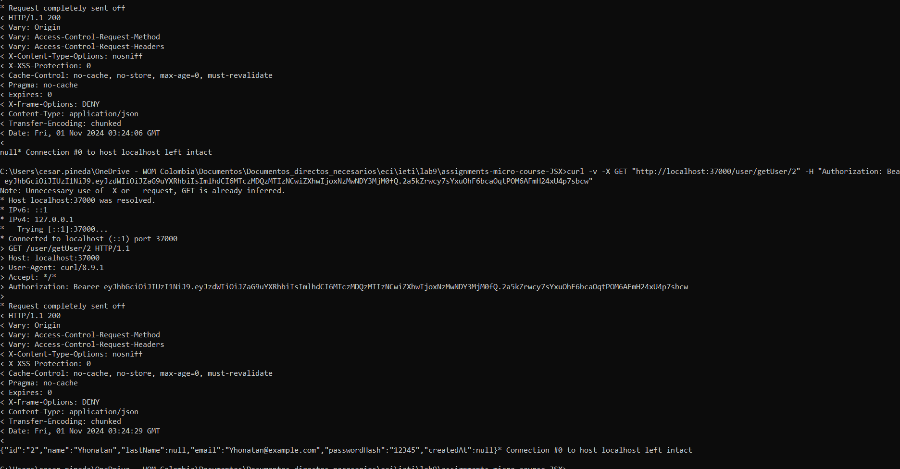

# Street Bites 🍔🍕
 
# Entrega 1
 
## **Descripción**😋
Es un aplicativo web que permite a los usuarios descubrir deliciosos lugares para comer, desde puestos callejeros hasta restaurantes locales, sin comprometer su presupuesto. Al mismo tiempo, brinda una plataforma a pequeños y medianos negocios para darse a conocer y atraer más clientes, fomentando el crecimiento económico de las comunidades locales. Utiliza Machine Learning para perfilar a los usuarios, analizando sus preferencias, hábitos de consumo y ubicación, con el fin de ofrecer recomendaciones personalizadas. A medida que el usuario interactúa con el aplicativo, la inteligencia artificial aprende sus gustos y ajusta las sugerencias para mostrar las mejores opciones de comida, mejorando continuamente la experiencia gastronómica y haciendo las recomendaciones más precisas y adecuadas a sus necesidades.
 
## Objetivo del proyecto 🚀
 
Proporcionar una plataforma que permita a los usuarios descubrir opciones de comida
alineadas con sus gustos, mientras se impulsa el crecimiento y la visibilidad de negocios locales,
pequeños y del sector informal.
 
 
 
 
### Objetivo del entregable:
Desarrollar un prototipo visual usando IA Generativa y un modelo de datos, y luego implementar controladores con conexión a la persistencia de datos.
 
1. Configuración del Repositorio: [URL Proyecto](https://github.com/jacro103/Prototipo_ieti)
 
- Crear un repositorio en GitHub para el proyecto. ✅
- Configurar acceso para el equipo de trabajo. ✅
- Iniciar un proyecto con configuración base y crear un README.md. ✅
2. Diseño del Modelo de Datos:
#### Diagrama de clases
 

 
- Definir el modelo de datos (usuarios, productos, pedidos). ✅
- Implementar clases con los tipos de datos y métodos necesarios. ✅
3. Prototipo Visual con IA Generativa:
- Investigar y seleccionar herramientas de IA Generativa. ✅
- Crear prototipos visuales que informen el diseño de la interfaz del proyecto. ✅
Se desarrollaron prototipos visuales mediante la herramienta de [DALL-E](https://github.com/jacro103/Prototipo_ieti) donde DALL-E es un modelo de inteligencia artificial desarrollado por OpenAI que puede generar imágenes a partir de descripciones textuales.
 
## Login

 
 

 
 
4. Implementación de Controladores y Servicios REST:
 
- Desarrollar controladores para gestionar peticiones HTTP (GET, POST, PUT, DELETE). ✅
- Implementar servicios REST siguiendo el nivel 2 del modelo de madurez de Richardson. ✅
- Realizar operaciones CRUD sobre los modelos de datos. ✅
 
5. Integración con MongoDB:
 
- Crear y configurar un cluster en MongoDB Atlas. ✅

 
- Conectar la base de datos MongoDB con el proyecto. ✅
- Implementar operaciones de base de datos en los controladores. ✅
Ejemplo de Proyecto: EcomHub
Descripción: EcomHub es una plataforma de ecommerce donde los usuarios pueden comprar y vender productos. Incluye gestión de usuarios, productos y pedidos.
 
 
# Entrega 2  🍔🍕
 
## Proyecto Backend con Autenticación JWT, Pruebas Unitarias y Despliegue
 
Este proyecto consiste en un backend desarrollado en java con autenticación JWT, pruebas unitarias y un despliegue en servidor. A continuación, se describen las funcionalidades clave, instrucciones de configuración, y detalles de implementación.
 
## Cambios desde la primera entrega
Se decidio pasar el repositorio  [prototipo_ieti](https://github.com/jacro103/Prototipo_ieti.git) a un nuevo repositorio para poder gestionar mejor el proyecto
 
1. Clona el repositorio:
 
   ```bash
   git clone https://github.com/CesarPineda14/proyectIeti.git
 
### Entrega
 
1. **Implementación de JWT**:
   - **Autenticación Segura**: Autenticación basada en JWT (JSON Web Token) para proteger los endpoints.  ✅
   - **Rutas de Registro y Login**: Rutas dedicadas para el registro y autenticación de usuarios. ✅
   - **Generación y Validación de Tokens**: Gestión completa del ciclo de vida de los tokens para validar el acceso de los usuarios a rutas protegidas. ✅
 
2. **Pruebas Unitarias**:
   - **Cobertura de Controladores y Servicios**: Pruebas unitarias que cubren controladores y servicios utilizando Mocha. ✅
   - **Funcionalidades CRUD**: Pruebas de todas las operaciones CRUD principales. ✅
   - **Herramientas de Pruebas**: Uso de herramientas populares para asegurar la calidad y el correcto funcionamiento del código. ✅
 
3. **Documentación y Despliegue**:
   - **Documentación Completa del Código y APIs**: Explicaciones claras de la lógica y los endpoints. ✅
   - **Repositorio GitHub**: Gestión de versiones y control de cambios mediante GitHub. ✅
   - **Despliegue en Servidor**: Configuración y despliegue en Heroku u otro servidor adecuado. ✅
   - **Instrucciones de Configuración y Ejecución**: Guía paso a paso para configurar y ejecutar el proyecto en distintos entornos. ✅
 
## Prueba

 
## Requisitos Previos
 
- **java**: Versión 17 o superior. 
- **MongoDB**: Base de datos utilizada en el proyecto.
 
 
## Configuración del Proyecto
 
1. Clona el repositorio:
 
   ```bash
   git clone https://github.com/CesarPineda14/proyectIeti.git

 
 
## Autores ✒️
 
 
* **Cesar Javier Pineda Delgado** - *CesarPineda14* - [CesarPineda14](https://github.com/CesarPineda14)
* **Yhonatan Steven Gomez Jimenez** - *YhonatanGoomez* - [YhonatanGoomez](https://github.com/YhonatanGoomez)
* **Steven Alejandro Huertas Lemus** - *Alejandrolhuertass* - [YhonatanGoomez](https://github.com/AlejandroLHuertass)
* **José Alejandro Correa Rodríguez** - *jacro103* - [jacro103](https://github.com/jacro103)
 
* **Carlos Alberto Sorza Gomez** - *carlossorza* - [carlossorza](https://github.com/CarlosSorza)